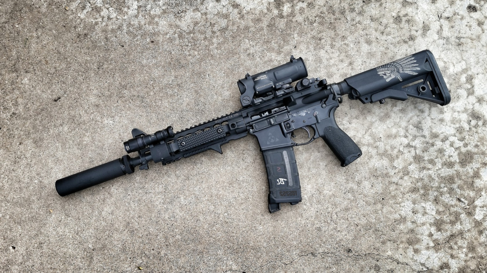
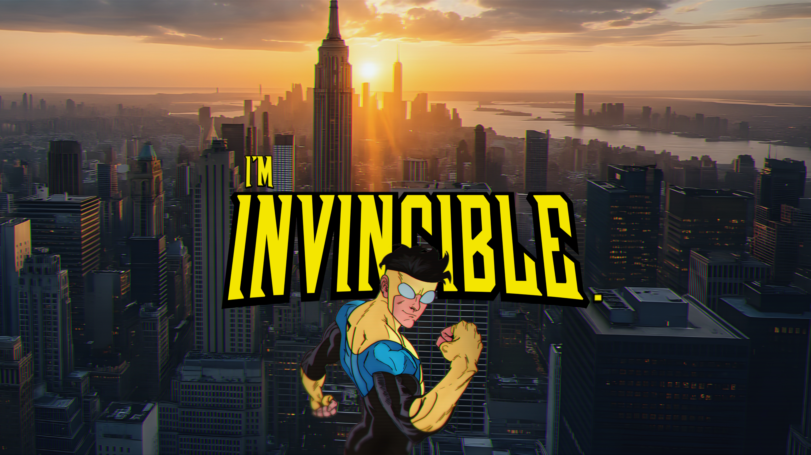
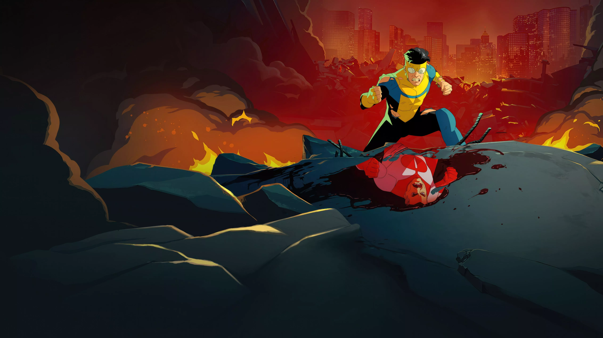
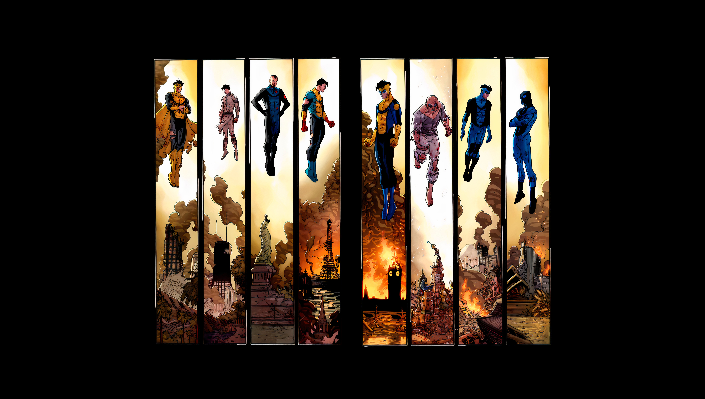
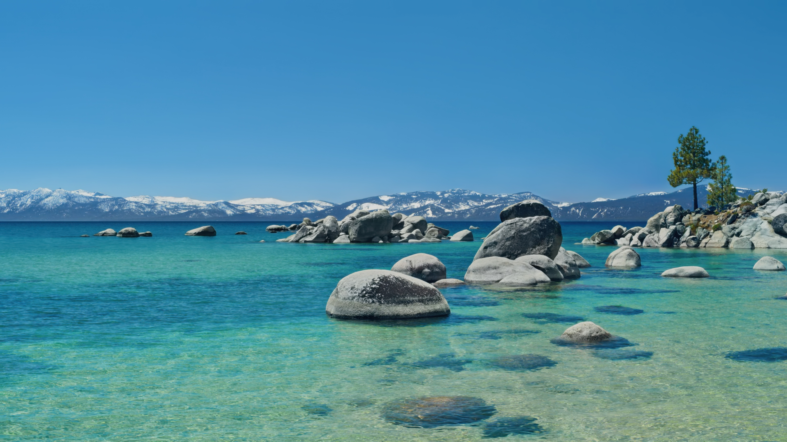
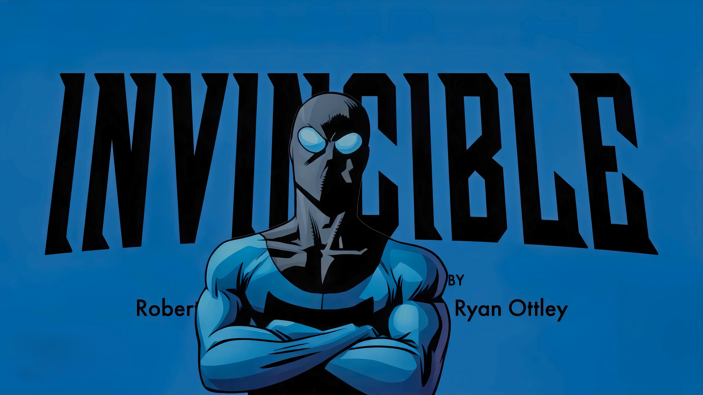
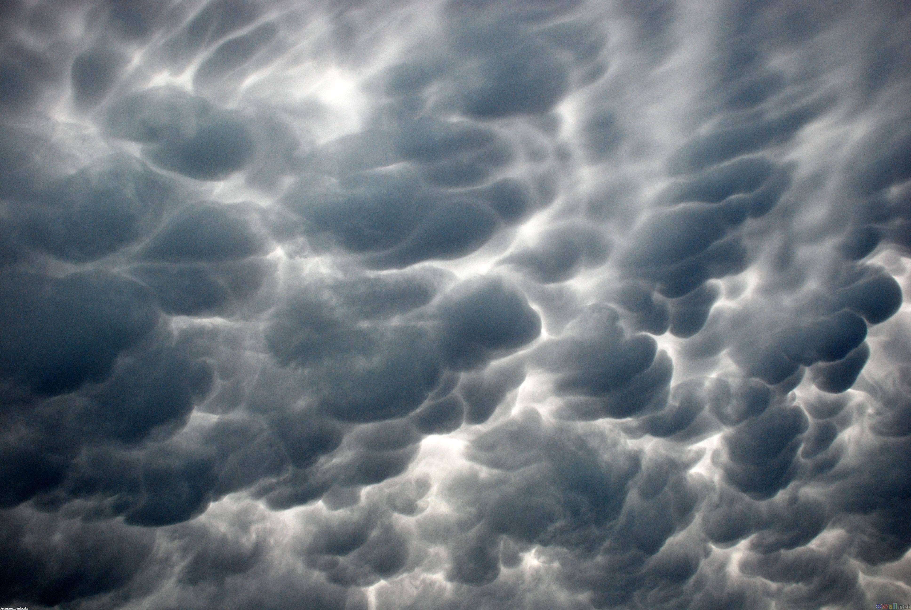
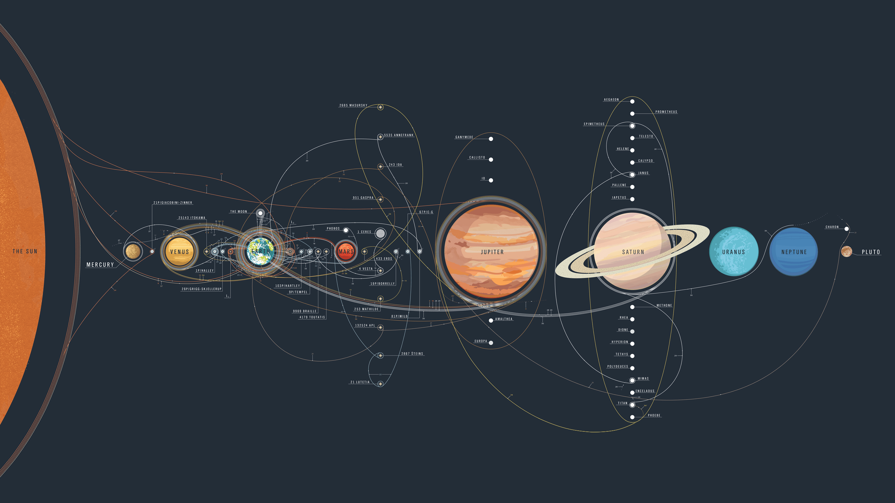

# Wallpapers Collection

A collection of wallpapers I use for my rice.

| | | |
|:---:|:---:|:---:|
|    `Batman_.png` |    `Biker_Girl.jpg` |    `Linux-user-Room.png` |
|    `Lofi_Cat.png` |    `MEDIA-battlefield-4.jpg` |    `Red_samurai.png` |
|    `a_beach_with_trees_on_the_side.jpg` |    `aesthetic_deer.png` |    `apple-pro-display.jpg` |
|    `beach.jpg` |    `cherry-flowers.png` |    `clouds.jpg` |
|    `colors.jpg` |    `cozywindow.jpg` |    `cyberpunk-girl-pink.png` |
|    `frozen_lake.png` |    `gradient-blu.png` |    `gruv_Arch.png` |
|    `gruv_Tux_2880x1920_v2.png` |    `gruv_Tux_dark.jpg` |    `light-ring.jpg` |
|    `man_without_a_face.png` |    `marmo-viola.png` |    `mazda.png` |
|    `monstera.png` |    `naturebed.jpg` |    `nun.jpeg` |
|    `ocean.jpg` |    `omni-man.jpg` |    `painting.jpg` |
|    `pink-ring.png` |    `purple-flower.jpg` |    `purplePlane.jpg` |
|    `r6-frostbuck.jpg` |    `resurrecting-spiderman.jpg` |    `retro-room.png` |
|    `sea-turtle.jpg` |    `shadow-of-the-tomb-raider.jpg` |    `space-view.jpg` |
|    `space_suit.png` |    `spiderman2.jpeg` |    `starwars_and_fruit_on_a_table.png` |
|    `thragg-vs-battle-beast-invincible-2569673561.jpg` |    `windows-11.jpg` |    `wolf_and_a_lion.png` |
|    `Linux_Friends.png` |    `acog-rifles.jpg` |    `im_invincible.jpg` |
|    `invincible_blood.webp` |    `invincible-war.jpg` |    `light_beach.jpg` |
|    `mac-os-tahoe-beach-day.jpg` |    `macosGoldenGate_dark.png` |    `mask_invincible.jpg` |
|    `nixos-logo.png` |    `nord-spider_man.jpg` |    `r6-tournament.jpg` |
|    `rainy_cloud.jpg` |    `solar_system.png` |  |

